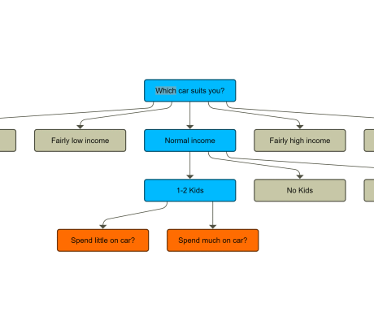

# Decision Tree Demo

[You can also run this demo online](https://live.yworks.com/demos/complete/decisiontree/index.html).

This demo shows how to create an interactive decision tree from a graph.

The decision tree contains different types of nodes.

- Orange nodes are the current options that can be clicked in order to expand the next tree level.
- Blue nodes are nodes that have been previously chosen.
- Grey nodes represent options along the path that have not been chosen.
- Green nodes are end nodes.

## Things to Try

### Decision Tree

- Browse the _Sample Graphs_.
- Click the _orange nodes_ to make a decision and expand the next level of the tree.
- Click the _blue_ or _grey nodes_ to reset the decision tree back to this level and select the clicked option.
- Click _Restart_ to reset the current decision tree.
- Click the _edit button_ to edit the current sample and view the complete graph.

### Edit View

- Modify the current sample graph or load other graphs from your computer.
- Right click a node and select "Set as root node" to start the decision tree at this node. Right click the empty canvas to clear the root node.
- Click the _start button_ to start the decision tree with the current graph.

## Source Graph Structure

The _DecisionTree_ component supports different formats of graphs.

- The source graph doesn't have to be a tree. It can be an arbitrary graph structure.
- Loops in the graph are supported (see _quiz_ sample).
- The graph can contain group nodes, but the clickable nodes have to be normal nodes.
- Only group nodes that are direct parents of clickable nodes appear in the decision graph.
- Edges connecting nodes in groups can either end directly at the child nodes (as in the _quiz_ sample), or at the containing group node (as in the _what-to-do_ sample).

The first node that's found that has no incoming edges serves as the start node. The _DecisionTree_ component also supports explicitly specifying a start node.
