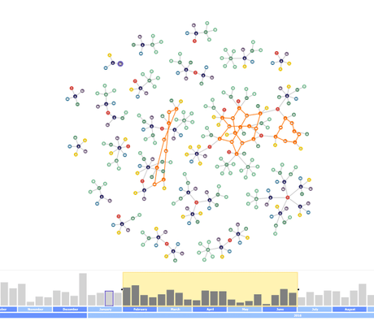

# Fraud Detection Demo

[You can also run this demo online](https://live.yworks.com/demos/complete/frauddetection/index.html).

This demo shows how _yFiles for HTML_ can be used for detecting _fraud cases_ in time-dependent data. Fraud affects many companies worldwide causing economic loss and liability issues. Fraud detection relies on the analysis of a huge amount of data-sets and thus, visualizations can be valuable for the quick detection of fraud schemes.

## Main Graph Component

- Shows the graph according to the current time frame.
- Provides additional information for the nodes on _right-click_.
- Highlights fraud rings on _hover_.
- Updates the highlights/selection in the timeline when _hovering/selecting_ non-fraud nodes.
- Comes with a special zooming mode: _Shift_\-press zooms out and _Shift_\-release zooms to the current mouse location.

## Timeline Component

- Shows the number of node creation/removal events with a bar for each point in time.
- Contains a time frame rectangle to select which time segment is represented in the main graph by _resizing/dragging_ it or by double-clicking at a specific location.
- Provides three detail levels (days/months/years) that are switched by _scrolling_ anywhere in the component.
- Updates the highlights/selection in the main graph when _hovering/selecting_ bars.
- Offers a \-button to automatically move the time frame to the right while updating the main graph.

## Detailed View Component

- Opens a detailed view of a fraud ring when _clicking_ on fraud ring elements or the according \-symbol in the toolbar. Also, hover on a \-symbol animates the view port to the corresponding fraud component.
- Shows a single graph component that contains fraud rings along with its own timeline.
- Updates the layout when _clicking_ the Layout-button in the toolbar.
