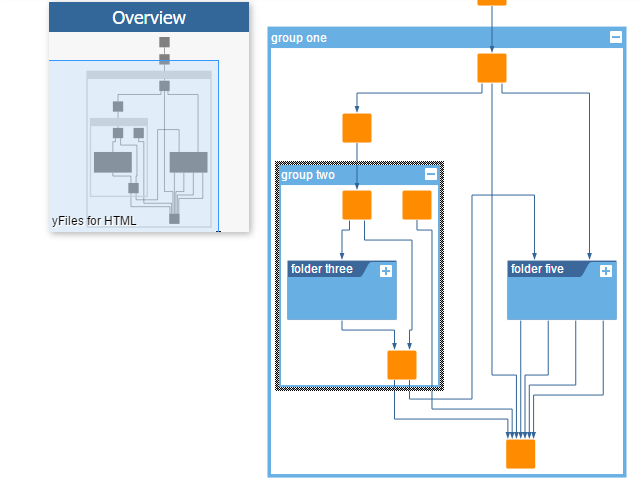

# Hierarchic Grouping Demo

[You can also run this demo online](https://live.yworks.com/demos/complete/hierarchicgrouping/index.html).

# Hierarchic Grouping Demo

The Hierarchic Grouping demo shows how to nicely expand and collapse sub-graphs organized in groups. Folding ('collapsed groups') can help to keep complex hierarchically organized diagrams clear and straightforward by showing only parts of the entire structure.

Additionally, each user action triggers a run of the _incremental mode_ of the _hierarchic layout algorithm_ to ensure that the currently visible part of the graph is always well-organized but remains still similar to the previous arrangement.

Recursive edges are edges whose source is inside a group node while its target is outside this group node, and vice versa. When those edges leave a group node at the side to reach a node left or right of the group node, information to keep the layout stable after expanding/collapsing the group node may be lost.  
Therefore, a new routing style is introduced which will preserve this information. This routing style forces all edges to enter groups at the top and leave them at the bottom.

## Things to Try

- Expand or collapse a group node with the `+` or `-` button.
