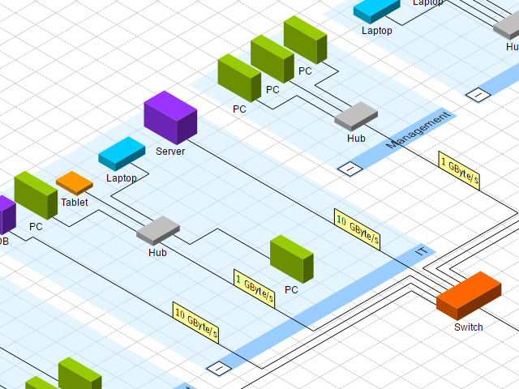

# Isometric Drawing Demo

[You can also run this demo online](https://live.yworks.com/demos/complete/isometric/index.html).

This demo displays graphs isometrically.

## Interaction

As this demo is mainly a viewer, it is not possible to edit the graph structure.

- Left Click on Group State Icon opens/closes the group node and shows/hides its children.
- Left Drag on View moves view according to the difference between drag start and current mouse position.
- Mouse Wheel changes the zoom level of the view.

## Layout

There are two suitable layout algorithms to apply to the graph either from scratch or incrementally.

- Hierarchic layout
- Orthogonal layout
- Opening/closing groups either applies incremental hierarchic or orthogonal layout to the current diagram according to the last layout setting.

## Loading Graphs

Load your own graph and display it isometrically. Note that the contained styles need to be from the library or demos.
