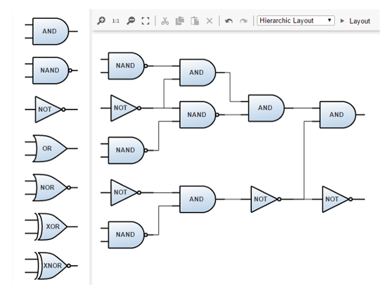

# Logic Gates Demo

[You can also run this demo online](https://live.yworks.com/demos/complete/logicgates/index.html).

# Logic Gates Demo

This demo shows how yfiles for HTML can be used for the visualization of a digital system consisted of logic gates.

Each node in this system has specific ports such that incoming edges are connected only to the left side of the target node, while outgoing edges connect to the right side of the source node. To achieve this, the notions of [PortConstraint](https://docs.yworks.com/yfileshtml/#/api/PortConstraint) and [PortCandidate](https://docs.yworks.com/yfileshtml/#/api/PortCandidate) have been used.

## Things to Try

- Drag nodes from the palette and connect them with edges. The new edges will also start and end at certain ports.
- Try to create a new edge. While creating the connection the possible end ports are indicated with green color. The edge will be created in the direction induced by the kind of port candidate (source/target) on which the drag has started.
- Hover over a node to see its available input (indicated by a reddish color) and output (indicated by a bluish color) ports.
- Re-assign a connection by dragging the endpoint of the particular edge.
- Apply the currently selected layout algorithm and notice that, the ports remain unchanged.
