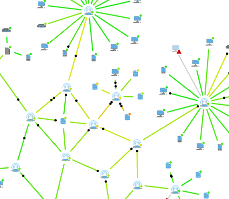

# Network Monitoring Demo

[You can also run this demo online](https://live.yworks.com/demos/complete/networkmonitoring/index.html).

This demo shows a basic network monitoring tool.

You can watch the traffic flowing through the network and even influence the network by deactivating nodes.

The network consists of PCs, Laptops, Tablets, Servers, Databases and Routers. The color of a connection depicts its traffic load and changes from green to yellow to red. The traffic load of a node is shown on its control panel pop-up.

The bar charts in the node popups are created using [D3.js](https://d3js.org/).

## Things to Try

### Show/Hide Node Control Panel

Every node has a control panel that shows its name, IP address and traffic load. You can show this panel by clicking on the node. Close the panel by clicking on the empty canvas area, or open the panel of another node.

### (De)activate Nodes

The control panel contains a power button that turns a node on and off. Deactivated nodes do not process data. This way you can influence the data flow and watch what happens when nodes fail.

### Enable Failures

When enabled, nodes and edges fail randomly and cannot process data anymore. Broken elements are marked with a stop sign. If a failure happens outside the current viewport, the viewport will focus on the broken element.

### Repair Failures

You can repair a failed element by clicking it.

## Mouse Interaction

### Mouse wheel

Changes the zoom level of the view.

### Left mouse drag

Moves the diagram within the view.

### Clicking a node

Opens the control panel for that node.

### Hover over a node or an edge

Shows the load of that element.

### Hover over a load indicator in the control panel

Shows the load of that node.

### Clicking a broken node or edge

Repairs that element.
