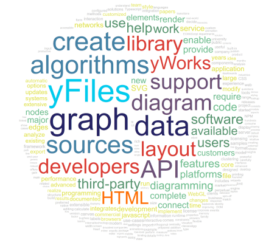

# Tag Cloud Demo

[You can also run this demo online](https://live.yworks.com/demos/complete/tag-cloud/index.html).

# Tag Cloud Demo

This demo shows how to create a _Tag Cloud_ visualization.

Tag clouds are a standard tool for visualizing text documents. The number of occurrences of a word in the text document is the word's _frequency_. The higher the frequency of a word, the more significant the word is. To convey a word's significance, its frequency determines the font size and text color of the word in the tag cloud. More frequent words are shown with increasingly larger font sizes.

For brevity's sake, the demo does not actually process word documents to calculate word frequencies, but uses prepared frequencies of a fictional document as its input.

## Things to Try

- Switch between two arrangement styles for the tag cloud, _Circle_ and _Rectangle_.
- Use the _Word Frequency_ slider to determine the minimum frequency for word to be included in the tag cloud.
