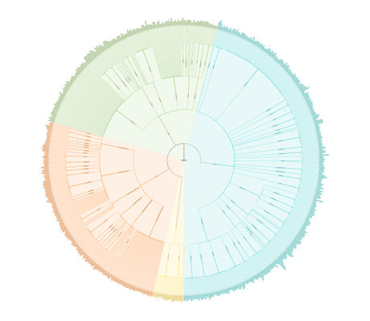

# Tree of Life Demo

[You can also run this demo online](https://live.yworks.com/demos/complete/tree-of-life/index.html).

# Tree of Life Demo

This demo shows an interactive radial dendrogram visualization for the so-called _Tree of Life_.

In biology, this is a tree structure used to describe the relationships (i.e., ancestors and descendants) between known extant and extinct species, ranging from the first organisms on Earth to the most complex creatures.

The dataset in this demo is not complete, and demonstrates only a portion of the over 2.3 million species that have lived on Earth.

For better interaction and rendering performance, WebGL2 is used for the rendering of the graph elements, if this is supported by the browser. Otherwise, the graph elements are rendered using SVG elements.

## Things to try

- Clicking on a node/species reveals the simpler phylogenetic tree with all the descendants of the selected species. Clicking again on the same node shows also its ancestors. Navigate also to the previous 10 ancestors using the breadcrumb menu in the toolbar.
- Hovering over a node or an edge of a sub-tree highlights its containing species and the relations among them.
- Use the combo-box to show the phylogenetic tree of the selected species.
- Toggle the _Show Extinct_ button to show/hide the extincted species.
- Use the search box to look for a specific species. The matched species will be highlighted.
