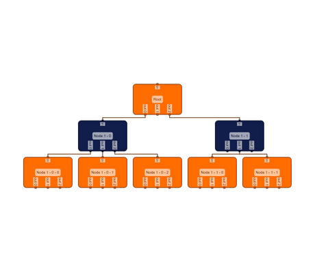

# Port-aware Tree Builder Demo

[You can also run this demo online](https://live.yworks.com/demos/databinding/port-aware-tree-builder/index.html).

# Port-aware Tree Builder Demo

This demo automatically builds a graph from business data using [TreeBuilder](https://docs.yworks.com/yfileshtml/#/api/TreeBuilder).  
The business data is stored in **JSON** format.

By default, a [TreeBuilder](https://docs.yworks.com/yfileshtml/#/dguide/graph_builder-TreeBuilder) connects the graph elements directly. It does not support further specification of the connection points (ports). The [Tree Builder](../treebuilder/index.html) demo shows such an unmodified TreeBuilder.

In this sample the TreeBuilder is modified to support ports. These ports are created based on the node data. Edges are connected to these specific ports.

Additionally, the demo shows how to update a graph built with TreeBuilder when the corresponding business data changes. See the source code for details.

## Things to Try

- Use the "Update" button to change the business data and update the graph. Note that existing elements are kept stable.
- Inspect the source code to see how the [TreeBuilder](https://docs.yworks.com/yfileshtml/#/api/TreeBuilder) can be modified to support ports.
