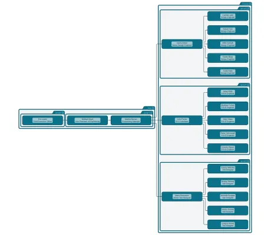

<!--
 //////////////////////////////////////////////////////////////////////////////
 // @license
 // This file is part of yFiles for HTML.
 // Use is subject to license terms.
 //
 // Copyright (c) 2026 by yWorks GmbH, Vor dem Kreuzberg 28,
 // 72070 Tuebingen, Germany. All rights reserved.
 //
 //////////////////////////////////////////////////////////////////////////////
-->
# Simple Graph Builder With Implicit Groups

[You can also run this demo online](https://www.yfiles.com/demos/databinding/simple-graph-builder-implicit-groups/).

This demo automatically builds a graph from business data using [GraphBuilder](https://docs.yworks.com/yfileshtml/api/GraphBuilder). The business data is stored in **JSON** format.

The objects representing nodes reference implicit groups that are not explicitly defined in a [NodesSource](https://docs.yworks.com/yfileshtml/api/GraphBuilder#createGroupNodesSource).

See the Developer's Guide section on [creating a Graph from Business Data](https://docs.yworks.com/yfileshtml/dguide/graph_builder) and especially [GraphBuilder](https://docs.yworks.com/yfileshtml/dguide/graph_builder-GraphBuilder) for an in-depth explanation of the relevant concepts.

See also the [GraphBuilder Tutorial](../../tutorial-graph-builder/01-create-graph/) for a step-by-step guide on configuring the [GraphBuilder](https://docs.yworks.com/yfileshtml/api/GraphBuilder) class, loading data, and customizing graph visualizations.

[GraphBuilder](https://docs.yworks.com/yfileshtml/api/GraphBuilder) provides a specific set of methods that allow to configure the builder on the given data source.

`createNodesSource`

Registers a data source that represents the nodes.

`createGroupNodesSource`

Registers a data source that represents the group nodes.

`createEdgesSource`

Registers a data source that represent the edges that connect the nodes.

`NodesSource.createChildNodesSource`

Registers a data source that represents the child nodes for a node in the NodesSource.

`NodesSource.createParentNodesSource`

Registers a data source that represents the group node for a node in the NodesSource.
