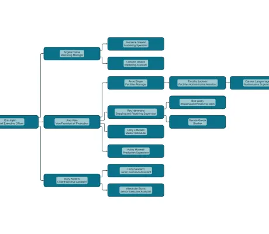

<!--
 //////////////////////////////////////////////////////////////////////////////
 // @license
 // This file is part of yFiles for HTML.
 // Use is subject to license terms.
 //
 // Copyright (c) 2026 by yWorks GmbH, Vor dem Kreuzberg 28,
 // 72070 Tuebingen, Germany. All rights reserved.
 //
 //////////////////////////////////////////////////////////////////////////////
-->
# Simple Tree Builder (JSON)

[You can also run this demo online](https://www.yfiles.com/demos/databinding/simple-tree-builder-json/).

This demo automatically builds a graph from business data using [TreeBuilder](https://docs.yworks.com/yfileshtml/api/TreeBuilder). The business data is stored in an Object in **JSON** format.

See the Developer's Guide section on [creating a Graph from Business Data](https://docs.yworks.com/yfileshtml/dguide/graph_builder) and especially [TreeBuilder](https://docs.yworks.com/yfileshtml/dguide/graph_builder-TreeBuilder) for an in-depth explanation of the relevant concepts.

See also the [GraphBuilder Tutorial](../../tutorial-graph-builder/01-create-graph/) for a step-by-step guide on configuring the [TreeBuilder](https://docs.yworks.com/yfileshtml/api/TreeBuilder) class, loading data, and customizing graph visualizations.

[TreeBuilder](https://docs.yworks.com/yfileshtml/api/TreeBuilder) provides a specific set of methods that allow to configure the builder on the given data source.

`createRootNodesSource`

Registers a data source that represents the root nodes.

`TreeNodesSource.createChildNodesSource`

Registers a data source as child entities of a [TreeNodesSource](https://docs.yworks.com/yfileshtml/api/TreeNodesSource).

`TreeNodesSource.addChildNodesSource`

Binds a collection of child data objects of a [TreeNodesSource](https://docs.yworks.com/yfileshtml/api/TreeNodesSource).
