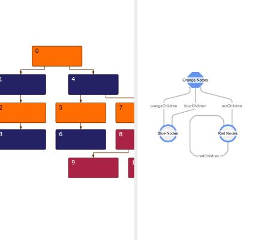

# Tree Builder Demo

[You can also run this demo online](https://live.yworks.com/demos/databinding/treebuilder/index.html).

This demo uses the class [TreeBuilder](https://docs.yworks.com/yfileshtml/#/api/TreeBuilder) to interactively build and modify a graph from business data.

See the the Developer's Guide section on the [TreeBuilder](https://docs.yworks.com/yfileshtml/#/dguide/graph_builder-TreeBuilder) for an in-depth explanation of the involved concepts.

The demo allows to define nodes sources and edges bindings using the schema graph component on the right.

## Things to Try

- Select a sample in the combo box and inspect its data and sources on the right.
- Double click on a node in the schema graph and edit the schema nodes' business data.
- Octagonal schema nodes represent root nodes sources that provide business data for the result graph structure and the visual configuration of the root nodes.
- Circular schema nodes represent child nodes sources that provide data for the visual representation of the child nodes.
- The schema graph edges and labels define the result graph edge bindings.
- Click on an edge or its label to edit the edge binding.
- Enter an empty edge label content to remove the edge and thus the result graph edge binding.
- Click into the empty space of the schema graph to create a new schema graph node.
- Drag from an existing schema graph node and drop on the empty space to create a new node connected to it.
- Connect existing schema graph nodes by dragging and dropping between them.
- Build a graph from your own data and bindings.

Since this demo evaluates the complete data source texts every time a source is edited, _Update Graph_ works as expected only for node data items of primitive type or if the node id binding resolves to primitive ids. Note that this restriction applies only to the demo, not the class [TreeBuilder](https://docs.yworks.com/yfileshtml/#/api/TreeBuilder).
