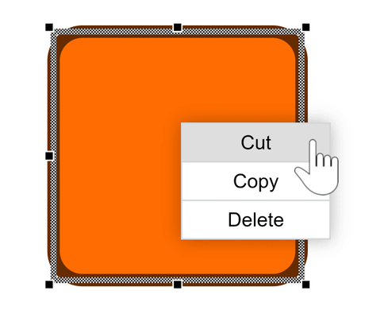

# Context Menu Demo

[You can also run this demo online](https://live.yworks.com/demos/input/contextmenu/index.html).

# Context Menu Demo

This demo shows how to add a context menu to the nodes of a graph and to the canvas background.

## Things to Try

- Right click on one of the nodes to open the _node context menu_.
- Select _multiple nodes_ and right click on one of them to apply the context menu actions to all selected nodes.
- Right click on an empty spot of the canvas to open a _different context menu_.

Note that, in this demo, a node gets selected also by right clicking on it. This is not the default behaviour but, is implemented explicitly in the event handler.
