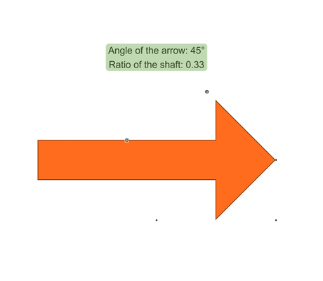

# Custom Handle Provider Demo

[You can also run this demo online](https://live.yworks.com/demos/input/custom-handle-provider/index.html).

# Custom Handle Provider Demo

This demo shows how to implement custom [IHandle](https://docs.yworks.com/yfileshtml/#/api/IHandle)s and an [IHandleProvider](https://docs.yworks.com/yfileshtml/#/api/IHandleProvider). In this example, these handles make it possible to interactively change the shape of the arrows visualized using [ArrowNodeStyle](https://docs.yworks.com/yfileshtml/#/api/ArrowNodeStyle).

## Things to try

- Drag the white rectangular handle of the selected node to change the [shaft ratio](https://docs.yworks.com/yfileshtml/#/api/ArrowNodeStyle#shaftRatio).
- Drag the circular handle of the selected node to change the [angle of the arrow blade](https://docs.yworks.com/yfileshtml/#/api/ArrowNodeStyle#angle).
- Observe how the angle and shaft values in the text box change as the handles are dragged.

To learn more about the [ArrowNodeStyle](https://docs.yworks.com/yfileshtml/#/api/ArrowNodeStyle) features in general, please see the [Arrow Node Style Demo](../../style/arrow-node-style/index.html).
