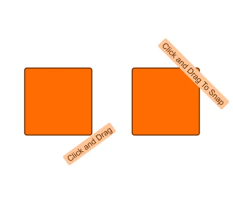

<!--
 //////////////////////////////////////////////////////////////////////////////
 // @license
 // This file is part of yFiles for HTML.
 // Use is subject to license terms.
 //
 // Copyright (c) by yWorks GmbH, Vor dem Kreuzberg 28,
 // 72070 Tuebingen, Germany. All rights reserved.
 //
 //////////////////////////////////////////////////////////////////////////////
-->
# Custom Label Model Demo

[You can also run this demo online](https://www.yfiles.com/demos/input/customlabelmodel/).

This demo shows how to create and use a custom label model.

## Thing to Try

- Create new nodes in the canvas.
- Click on one of the node labels and then drag the selected label.
- Try to save and load the graph.

## Related Demo

- See the [Custom Port Location Model Demo](../../input/customportmodel/) to learn how to customize the models for port locations. Note that the code is very similar as the same concepts are being applied.
