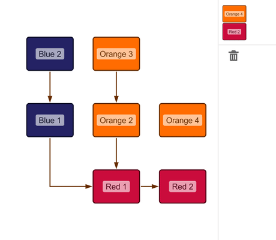

# Drag From Component

[You can also run this demo online](https://live.yworks.com/demos/input/drag-from-component/index.html).

# Drag From Component

This demo shows how to use the HTML5 Drag and Drop support to drag graph items from the component to other HTML elements.

## Things to Try

- Drag a node from the component to the element at the top right ("Drop Here").
- Drag a node from the component to the trashcan symbol to remove it from the graph.
- Edit the graph as usual. Note:
  - Dragging a node will let you drag it from the component.
  - Dragging a selected node while pressing the SHIFT key will move the node on the component.
  - Dragging an unselected node with SHIFT held down will start edge creation.

## Related Demos

- [Drag and Drop](../draganddrop)
- [Graph Drag and Drop](../graph-drag-and-drop)
- [Custom Drag and Drop](../custom-drag-and-drop)
- [Tutorial: Drag and Drop](../../03-tutorial-application-features/drag-and-drop/index.html)
