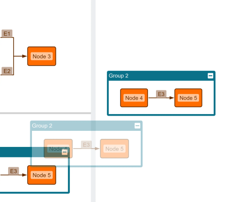

# Graph Drag and Drop Demo

[You can also run this demo online](https://live.yworks.com/demos/input/graph-drag-and-drop/index.html).

# Graph Drag and Drop Demo

This demo shows how to add drag and drop of graphs to an app.

yFiles for HTML supports [drag and drop of single items](https://docs.yworks.com/yfileshtml/#/dguide/interaction-support#interaction-drag_drop) out of the box.

This demo contains a custom implementation of a [DropInputMode](https://docs.yworks.com/yfileshtml/#/api/DropInputMode) that enables drag and drop of multiple graph items and entire graphs.

## Things to Try

- Drag and drop some graphs from the palette onto the graph component.
- Drag a graph over a group node to see group node highlighting.
- Drop a graph over a group node to place it inside the group.
- Enable **Folders As Parents** and drop a graph over a folder node to place it inside the folder.
- Switch off the **Preview** or the **Snapping** features.

## Related Demos

- [Drag and Drop](../draganddrop)
- [Drag From Component](../drag-from-component)
- [Custom Drag and Drop](../custom-drag-and-drop)
- [Tutorial: Drag and Drop](../../03-tutorial-application-features/drag-and-drop/index.html)
