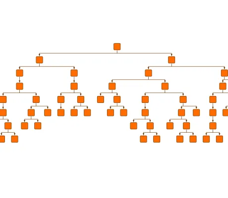

<!--
 //////////////////////////////////////////////////////////////////////////////
 // @license
 // This file is part of yFiles for HTML.
 // Use is subject to license terms.
 //
 // Copyright (c) by yWorks GmbH, Vor dem Kreuzberg 28,
 // 72070 Tuebingen, Germany. All rights reserved.
 //
 //////////////////////////////////////////////////////////////////////////////
-->
# Interactive Graph Restructuring Demo

[You can also run this demo online](https://www.yfiles.com/demos/input/interactivegraphrestructuring/).

A demo that shows how to interactively relocate subtrees from one parent to another.

Every time that a node is selected, the subtree rooted at this particular node is dragged interactively, and [ClearAreaLayout](https://docs.yworks.com/yfileshtml/#/api/ClearAreaLayout) will try to create free space by pushing away the other elements of the graph so that the dragged subtree is relocated to another parent.

## Things to Try

Drag a node with its subtree to another location and see how the graph tries to accommodate it. The node that is highlighted will be the new parent of the moved subtree.
