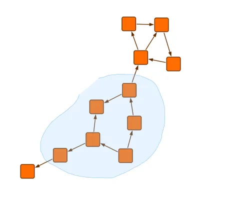

<!--
 //////////////////////////////////////////////////////////////////////////////
 // @license
 // This file is part of yFiles for HTML.
 // Use is subject to license terms.
 //
 // Copyright (c) by yWorks GmbH, Vor dem Kreuzberg 28,
 // 72070 Tuebingen, Germany. All rights reserved.
 //
 //////////////////////////////////////////////////////////////////////////////
-->
# Lasso Selection

[You can also run this demo online](https://www.yfiles.com/demos/input/lasso-selection/).

This demo shows how to use [LassoSelectionInputMode](https://docs.yworks.com/yfileshtml/#/api/LassoSelectionInputMode) to select graph elements by drawing a lasso around them.

## Things to Try

- **Selection Styles:** Choose between different selection styles:
  - **Free-hand Selection:** Draw a free-form shape around elements by dragging the mouse.
  - **Polyline Selection:** Create a polygon by clicking to add points. Double-click to complete the selection.
  - **Marquee Selection:** Use the traditional rectangular selection by dragging the mouse.

- **Select Nodes:** Choose how nodes are considered selected by the lasso tool:
  - **Nodes Complete:** Nodes are selected only if fully contained within the lasso path.
  - **Nodes Intersected:** Nodes are selected if they intersect or are fully contained within the lasso path.
  - **Nodes Center:** Nodes are selected only if their center point is contained within the lasso path.

- **Finish Radius:** Adjust the radius around the starting point where the lasso can be closed. When dragging the lasso near the starting point, a circle with the corresponding radius is highlighted.
