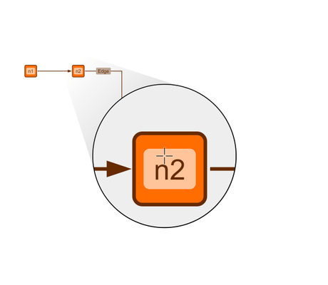

# Magnifying Glass Demo

[You can also run this demo online](https://live.yworks.com/demos/input/magnifying-glass/index.html).

# Magnifying Glass Demo

This demo shows a floating magnifying glass that magnifies the cursor's surroundings. It is implemented as a specialized input mode that can be added to any of yFiles's default interactions.

The magnifying lens is visible only at low zoom levels `(< 0.7)` since otherwise the graph is large enough and details of the elements can be distinguished even without magnification.

**Current zoom level:** 0.5

## Things to Try

- Hover with the mouse cursor over the graph elements that need magnification.
- Adjust the lens zoom using the combo box and observe the higher or lower magnification.
