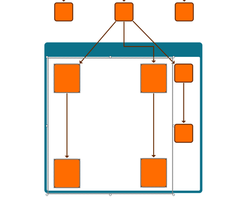

# Node Selection Resizing Demo

[You can also run this demo online](https://live.yworks.com/demos/input/nodeselectionresizing/index.html).

This demo shows how to implement resizing handles for a selection of nodes. When multiple nodes are selected, dragging the reshape handles will resize the selection as a whole. This demo supports two modes:

- **Resize Nodes:** Scales the selected items uniformly by scaling both the locations and the node sizes.
- **Scale Locations:** Scales the item locations while preserving node sizes.

## Things to Try

- Select a single item to get the default move and resize behavior.
- Select _multiple nodes_ and drag the handles to resize the selection.
- Hold down the `SHIFT` key while resizing to preserve the aspect ratio. Hold down the `ALT` key to resize around the center. You can do both at the same time.
- Switch between the two resize modes in the toolbar to see their effect.
- Turn on _orthogonal edge editing_ in the toolbar to see how it affects bend movement.
- Turn on _snapping_ in the toolbar to let the selected nodes snap to other items in the graph.
- Make the selection rectangle very small or very large to see how resizing respects _size constraints_.

This feature is implemented as custom [IInputMode](https://docs.yworks.com/yfileshtml/#/api/IInputMode) that can be added to a [GraphEditorInputMode](https://docs.yworks.com/yfileshtml/#/api/GraphEditorInputMode).
