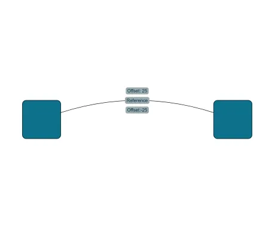

<!--
 //////////////////////////////////////////////////////////////////////////////
 // @license
 // This file is part of yFiles for HTML.
 // Use is subject to license terms.
 //
 // Copyright (c) by yWorks GmbH, Vor dem Kreuzberg 28,
 // 72070 Tuebingen, Germany. All rights reserved.
 //
 //////////////////////////////////////////////////////////////////////////////
-->
# Offset Wrapper Label Model

[You can also run this demo online](https://www.yfiles.com/demos/input/offset-wrapper-label-model/).

This demo shows how to implement a custom label model to add an adjustable offset to labels created by another label model.

## Things to Try

- Modify the offset value to see how labels shift their positions.

## Demos

- [Border-Aligned Label Model Demo](../../input/border-aligned-label-model/)
- [Custom Port Location Model Demo](../../input/customportmodel/)
