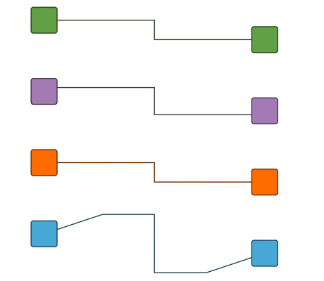

# Orthogonal Edge Editing Demo

[You can also run this demo online](https://live.yworks.com/demos/input/orthogonaledges/index.html).

# Orthogonal Edge Editing Demo

This demo shows the customization of orthogonal edge editing.

Using the [GraphDecorator](https://docs.yworks.com/yfileshtml/#/api/GraphDecorator), the edge is decorated with custom implementations of the [IOrthogonalEdgeHelper](https://docs.yworks.com/yfileshtml/#/api/IOrthogonalEdgeHelper) interface.

## Things to Try

Drag segments and bends of the edges and observe the different characteristics.

## Edge Types

- _Red edge_: Orthogonal edge editing is disabled. The segments are straight lines with arbitrary slope. Dragging an unselected segment creates a new bend.
- _Green edge_: Orthogonal edge editing is enabled. While dragging, all segments stay orthogonal and new bends are created as needed.
- _Purple edge_: Same behavior as the green edge. In addition, the locations of the source port and target port are constraint to the given port candidates of the nodes.
- _Orange edge_: Same behavior as the green edge. In addition, the source port and the target port can be placed at any location inside the node since they use dynamic port candidates.
- _Blue edge_: Orthogonal edge editing is enabled for the inner segments but the first and the last segment can have an arbitrary slope. If a new bend is added to one of these two segments, the newly created inner segment becomes orthogonal immediately.
