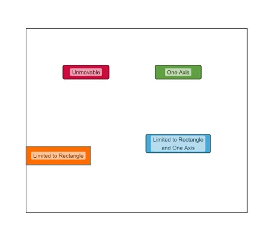

<!--
 //////////////////////////////////////////////////////////////////////////////
 // @license
 // This file is part of yFiles for HTML.
 // Use is subject to license terms.
 //
 // Copyright (c) by yWorks GmbH, Vor dem Kreuzberg 28,
 // 72070 Tuebingen, Germany. All rights reserved.
 //
 //////////////////////////////////////////////////////////////////////////////
-->
# Position Handler Demo

[You can also run this demo online](https://www.yworks.com/demos/input/positionhandler/).

This demo shows how to customize and restrict the movement behavior of nodes.

This is done with custom implementations of the interface [IPositionHandler](https://docs.yworks.com/yfileshtml/#/api/IPositionHandler) that are added to the lookup of the nodes.

## Things to Try

Select and move the nodes.

## Node Types

- _Red nodes_ are unmovable.
- _Green nodes_ move only vertically or horizontally from the current start point.
- _Orange nodes_ move freely within the displayed rectangle but cannot leave it.
- _Blue nodes_ combine the green and orange restrictions: they move only vertically or horizontally and cannot leave the rectangle.
