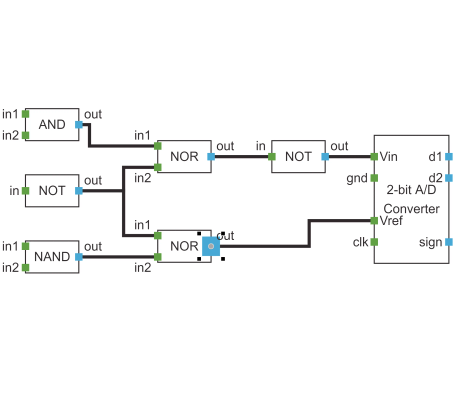

# Reshape Handle Provider Demo

[You can also run this demo online](https://live.yworks.com/demos/input/reshapehandleprovider/index.html).

# Reshape Handle Provider Demo

This demo shows how to implement a custom [IReshapeHandleProvider](https://docs.yworks.com/yfileshtml/#/api/IReshapeHandleProvider).

This _IReshapeHandleProvider_ is provided for ports to reshape their port visualization.

## Things to Try

- Select a _green_ or _blue_ port and see its reshape handles at its corners. Also note that there is a different handle at the center that was provided by the _IHandleProvider_ to change the port location.
- Drag one of the reshape handles to change the size of the port visualization. Note that the size can't be decreased below a specific minimum size.
- Press and hold **Ctrl** and see that further reshape handles appear on the left, right, top and bottom side of selected ports. These handles reshape the port either horizontally or vertically.
