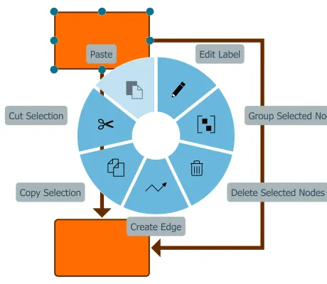

<!--
 //////////////////////////////////////////////////////////////////////////////
 // @license
 // This file is part of yFiles for HTML.
 // Use is subject to license terms.
 //
 // Copyright (c) by yWorks GmbH, Vor dem Kreuzberg 28,
 // 72070 Tuebingen, Germany. All rights reserved.
 //
 //////////////////////////////////////////////////////////////////////////////
-->
# Touch Interaction

[You can also run this demo online](https://www.yfiles.com/demos/input/touchcustomization/).

This demo shows how a graph editor application can be optimized for touch devices.

## Things to Try

- Change the "Snap Touch Panning" behavior and see how it affects graph panning.

  Horizontal

  Locks near-horizontal panning to the x-axis.

  Vertical

  Locks near-vertical panning to the y-axis.

  Both

  Snaps near-horizontal and near-vertical panning.

- Change the "Start Touch Panning" behavior and see how it affects graph panning.

  One Finger

  Starts viewport panning by dragging with one finger and edit gestures after a long press delay.

  Two Fingers

  Starts viewport panning by dragging with at least two fingers. This allows edit gestures (e.g. node resize) to be started immediately without a long press delay.

- Create nodes by dragging them from the palette into the canvas.
- Navigate the graph by dragging with either one or two fingers, depending on the "Start Touch Panning" option. Pinch-zoom with two fingers.
- Select a node by tapping it. Drag the node handles to change the node's size. Drag the node itself to move it around.
- Double Tap quickly on the empty canvas area to start the lasso selection tool. Release the finger to complete the selection gesture.
- Long Press a graph item to open its context menu or the empty canvas area to open the background context menu.
- Create nodes using the background context menu.
- Create an edge by selecting "Create Edge" from a node's context menu.
