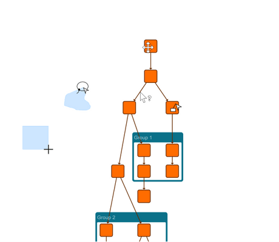

# Valid Begin Cursors Demo

[You can also run this demo online](https://live.yworks.com/demos/input/valid-begin-cursors/index.html).

# Valid Begin Cursor Demo

The demo exhibits a [GraphComponent](https://docs.yworks.com/yfileshtml/#/api/GraphComponent) where graph editing is configured to show different cursors depending on which gesture is valid to begin at the current location considering the currently pressed modifiers.

Some input modes were configured to only begin when a specific modifier is pressed to distinguish which gesture should start.

## Things to try

- **Move the viewport** by pressing Ctrl while hovering on an empty location on the canvas. Its valid beginning is indicated by [Cursor.GRAB](https://docs.yworks.com/yfileshtml/#/api/Cursor#GRAB)
- **Start lasso selection** by pressing Shift while hovering on an empty location on the canvas. Its valid beginning is indicated by a custom lasso cursor.
- **Start marquee selection** when neither Shift nor Ctrl is pressed while hovering on an empty location on the canvas. Its valid beginning is indicated by [Cursor.CROSSHAIR](https://docs.yworks.com/yfileshtml/#/api/Cursor#CROSSHAIR).
- **Create a new edge** by pressing Ctrl while hovering on an unselected node. Its valid beginning is indicated by a custom create-edge cursor.
- **Move a node** when Ctrl is **not** pressed while hovering on a selected or unselected node. Its valid beginning is indicated by [Cursor.MOVE](https://docs.yworks.com/yfileshtml/#/api/Cursor#MOVE).
- **Show tooltips** when hovering on an edge for a second. Hovering over a location where a tooltip may be displayed is indicated by [Cursor.HELP](https://docs.yworks.com/yfileshtml/#/api/Cursor#HELP).
