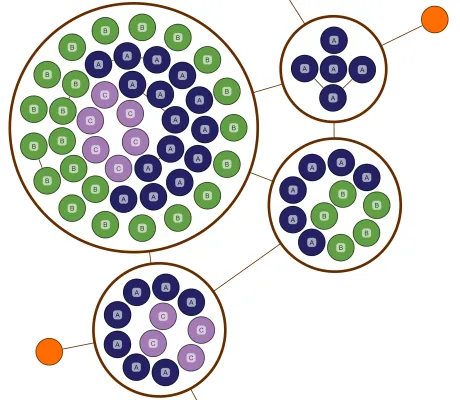

<!--
 //////////////////////////////////////////////////////////////////////////////
 // @license
 // This file is part of yFiles for HTML.
 // Use is subject to license terms.
 //
 // Copyright (c) 2026 by yWorks GmbH, Vor dem Kreuzberg 28,
 // 72070 Tuebingen, Germany. All rights reserved.
 //
 //////////////////////////////////////////////////////////////////////////////
-->
# Compact Disk Groups

[You can also run this demo online](https://www.yfiles.com/demos/layout-features/compact-disk-groups/).

This demo shows how to use the [CompactDiskLayout](https://docs.yworks.com/yfileshtml/api/CompactDiskLayout) to arrange the content of (circular) group nodes.

This layout is suitable when the group content should be arranged in a compact way and the child nodes have few or no edges between them.

It highlights the configuration of various aspects:

- [CompactDiskLayout](https://docs.yworks.com/yfileshtml/api/CompactDiskLayout) packs child nodes within each group in compact, circular way.
- Child nodes are ordered by [nodeTypes](https://docs.yworks.com/yfileshtml/api/CompactDiskLayoutData#nodeTypes), as indicated by their labels and colors.
- [RecursiveGroupLayout](https://docs.yworks.com/yfileshtml/api/RecursiveGroupLayout) handles the group nodes recursively.
- [OrganicLayout](https://docs.yworks.com/yfileshtml/api/OrganicLayout) arranges the top-level groups.

## Demos

- [Layout Styles: Compact Disk Demo](../../showcase/layoutstyles/index.html?layout=compact-disk&sample=compact-disk-with-edges)

## Documentation

- [Compact Disk Layout](https://docs.yworks.com/yfileshtml/dguide/compact_disk_layout)
- [CompactDiskLayout](https://docs.yworks.com/yfileshtml/api/CompactDiskLayout)
- [RecursiveGroupLayout](https://docs.yworks.com/yfileshtml/api/RecursiveGroupLayout)
