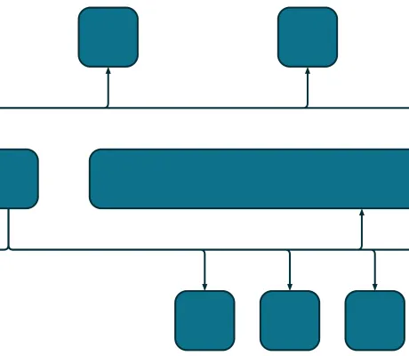

<!--
 //////////////////////////////////////////////////////////////////////////////
 // @license
 // This file is part of yFiles for HTML.
 // Use is subject to license terms.
 //
 // Copyright (c) by yWorks GmbH, Vor dem Kreuzberg 28,
 // 72070 Tuebingen, Germany. All rights reserved.
 //
 //////////////////////////////////////////////////////////////////////////////
-->
# Bus-Style Edge Routing (Custom)

[You can also run this demo online](https://www.yfiles.com/demos/layout-features/edge-router-buses-custom/).

This demo shows how to configure the [EdgeRouter](https://docs.yworks.com/yfileshtml/#/api/EdgeRouter) to generate orthogonal bus-style routes with manually defined backbone points. A bus is a shared segment among multiple edges, with nodes connecting to it via shorter segments.

Buses are defined using the `add` method of the [buses](https://docs.yworks.com/yfileshtml/#/api/EdgeRouterData#buses) property, which returns a [configurable object](https://docs.yworks.com/yfileshtml/#/api/ItemCollection) for edge assignment.

The [EdgeRouterBusDescriptor](https://docs.yworks.com/yfileshtml/#/api/EdgeRouterBusDescriptor) used in the `add` method offers customizable bus parameters.

## Custom Backbone Points

In this demo, the bus is defined using [busPoints](https://docs.yworks.com/yfileshtml/#/api/EdgeRouterBusDescriptor#busPoints), in which the location of the backbone segments is manually specified. This custom backbone path consists of a vertical segment and multiple horizontal segments, connecting nodes in a structured manner.

## Demos

- [Bus Routing Demo](../../layout/busrouting/)
- [Bus-Style Edge Routing Demo](../../layout-features/edge-router-buses/)
- [Layout Styles: Edge Router Demo](../../showcase/layoutstyles/index.html?layout=edge-router&sample=edge-router)

## Documentation

- [Bus-style routing](https://docs.yworks.com/yfileshtml/#/dguide/polyline_router_bus_routing)
- [EdgeRouter](https://docs.yworks.com/yfileshtml/#/api/EdgeRouter)
- [EdgeRouterData](https://docs.yworks.com/yfileshtml/#/api/EdgeRouterData)
- [EdgeRouterBusDescriptor](https://docs.yworks.com/yfileshtml/#/api/EdgeRouterBusDescriptor)
