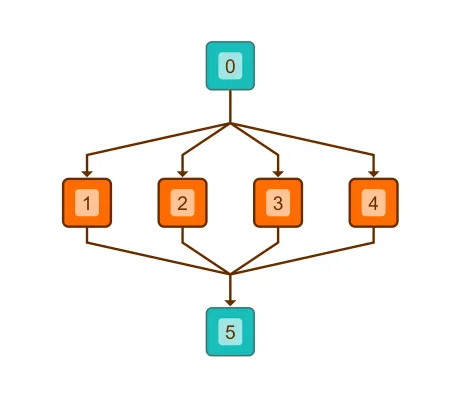

<!--
 //////////////////////////////////////////////////////////////////////////////
 // @license
 // This file is part of yFiles for HTML.
 // Use is subject to license terms.
 //
 // Copyright (c) by yWorks GmbH, Vor dem Kreuzberg 28,
 // 72070 Tuebingen, Germany. All rights reserved.
 //
 //////////////////////////////////////////////////////////////////////////////
-->
# Hierarchical Layout with Edge Grouping - Layout Features

[You can also run this demo online](https://www.yfiles.com/demos/layout-features/hierarchical-edge-grouping/).

This demo shows how to configure edge grouping for the [Hierarchical Layout](https://docs.yworks.com/yfileshtml/#/api/HierarchicalLayout).

For edges connecting to nodes `0` and `5`, source and target group IDs are configured, which causes the [HierarchicalLayout](https://docs.yworks.com/yfileshtml/#/api/HierarchicalLayout) to group them. The IDs are defined via properties [sourceGroupIds](https://docs.yworks.com/yfileshtml/#/api/HierarchicalLayoutData#sourceGroupIds) and [targetGroupIds](https://docs.yworks.com/yfileshtml/#/api/HierarchicalLayoutData#targetGroupIds).

Click the button in the toolbar to toggle between [HierarchicalLayout](https://docs.yworks.com/yfileshtml/#/api/HierarchicalLayout) with and without configured edge routing.

### Code Snippet

You can copy the code snippet to configure the layout from [GitHub](https://github.com/yWorks/yfiles-for-html-demos/blob/master/demos/layout-features/hierarchical-edge-grouping/HierarchicalEdgeGrouping.ts).

### Edge grouping for other layouts

The edge grouping setup for other algorithms that support the feature is basically identical. The respective [LayoutData](https://docs.yworks.com/yfileshtml/#/api/LayoutData) implementations offer the same properties, so that the snippet provided by this demo can easily be adjusted.

### Demos

You can also take a look at the [Edge Grouping Demo](../../layout/edgegrouping/) and the [EdgeRouter Grouping Demo](../../layout/edgeroutergrouping/) for more elaborate applications of edge grouping.

### Documentation

The Developer's Guide provides more information about [Layout with Edge Grouping](https://docs.yworks.com/yfileshtml/#/dguide/layout-edge_grouping).
