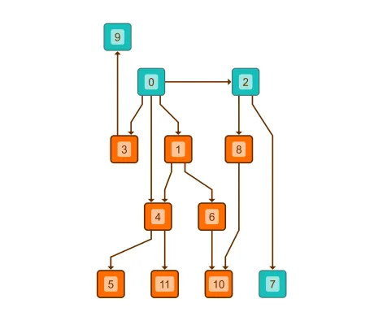

<!--
 //////////////////////////////////////////////////////////////////////////////
 // @license
 // This file is part of yFiles for HTML.
 // Use is subject to license terms.
 //
 // Copyright (c) by yWorks GmbH, Vor dem Kreuzberg 28,
 // 72070 Tuebingen, Germany. All rights reserved.
 //
 //////////////////////////////////////////////////////////////////////////////
-->
# Hierarchical Layout with Layer Constraints - Layout Features

[You can also run this demo online](https://www.yworks.com/demos/layout-features/hierarchical-layer-constraints/).

This demo shows how to customize the assignment of nodes to layers (layering) when using the [Hierarchical Layout](https://docs.yworks.com/yfileshtml/#/api/HierarchicalLayout).

### Layer constraints

Nodes 9 is placed in the topmost layer with the [placeAtTop](https://docs.yworks.com/yfileshtml/#/api/LayerConstraintData#placeAtTop) method.

Nodes 7 is placed in the bottommost layer with the [placeAtBottom](https://docs.yworks.com/yfileshtml/#/api/LayerConstraintData#placeAtBottom) method.

Nodes 0 is placed at least one layer below node 9 with the [placeBelow](https://docs.yworks.com/yfileshtml/#/api/LayerConstraintData#placeBelow) method.

Nodes 2 is placed in the same layer as node 0 with the [placeInSameLayer](https://docs.yworks.com/yfileshtml/#/api/LayerConstraintData#placeInSameLayer) method.

Click the button in the toolbar to toggle between [Hierarchical Layout](https://docs.yworks.com/yfileshtml/#/api/HierarchicalLayout) with and without configured constraints.

### Code Snippet

You can copy the code snippet to configure the layout from [GitHub](https://github.com/yWorks/yfiles-for-html-demos/blob/master/demos/layout-features/hierarchical-layer-constraints/HierarchicalLayerConstraints.ts).

### Demos

See the [Layer Constraints Demo](../../layout/layerconstraints/) for a more elaborate example of the constraints functionality.

### Documentation

See the [Constrained Node Sequencing](https://docs.yworks.com/yfileshtml/#/dguide/hierarchical_layout#hierarchical_layout-constrained_layer_assignment) section in the Developer's Guide for an in-depth discussion of the relevant concepts.

See the [LayerConstraintData](https://docs.yworks.com/yfileshtml/#/api/LayerConstraintData) API documentation for detailed information on all available constraints.
