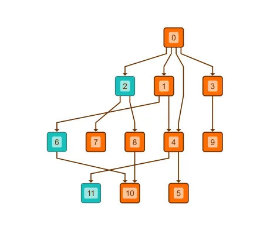

<!--
 //////////////////////////////////////////////////////////////////////////////
 // @license
 // This file is part of yFiles for HTML.
 // Use is subject to license terms.
 //
 // Copyright (c) by yWorks GmbH, Vor dem Kreuzberg 28,
 // 72070 Tuebingen, Germany. All rights reserved.
 //
 //////////////////////////////////////////////////////////////////////////////
-->
# Hierarchical Layout with Sequence Constraints - Layout Features

[You can also run this demo online](https://www.yfiles.com/demos/layout-features/hierarchical-sequence-constraints/).

This demo shows how to customize the order of the nodes in a layer (sequencing) when using [Hierarchical Layout](https://docs.yworks.com/yfileshtml/#/api/HierarchicalLayout).

### Sequence constraints

Nodes 2, 6 and 11 are configured to be placed at the beginning (or head) of the sequence with the [placeAtHead](https://docs.yworks.com/yfileshtml/#/api/SequenceConstraintData#placeAtHead) method.

Click the button in the toolbar to toggle between [Hierarchical Layout](https://docs.yworks.com/yfileshtml/#/api/HierarchicalLayout) with and without configured constraints.

### Code Snippet

You can copy the code snippet to configure the layout from [GitHub](https://github.com/yWorks/yfiles-for-html-demos/blob/master/demos/layout-features/hierarchical-sequence-constraints/HierarchicalSequenceConstraints.ts).

### Demos

See the [Sequence Constraints Demo](../../layout/sequenceconstraints/) for more elaborate examples of the constraints functionality.

### Documentation

See the [Constrained Node Sequencing](https://docs.yworks.com/yfileshtml/#/dguide/hierarchical_layout-constrained_node_sequencing) section in the Developer's Guide for an in-depth discussion of the relevant concepts.

See the [SequenceConstraintData](https://docs.yworks.com/yfileshtml/#/api/SequenceConstraintData) API documentation for detailed information on all available constraints.
