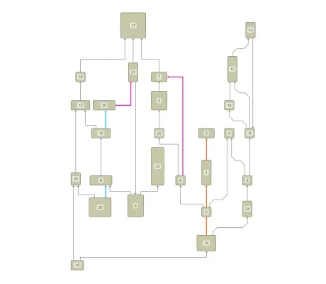

<!--
 //////////////////////////////////////////////////////////////////////////////
 // @license
 // This file is part of yFiles for HTML.
 // Use is subject to license terms.
 //
 // Copyright (c) 2026 by yWorks GmbH, Vor dem Kreuzberg 28,
 // 72070 Tuebingen, Germany. All rights reserved.
 //
 //////////////////////////////////////////////////////////////////////////////
-->
# Hierarchical Layout

[You can also run this demo online](https://www.yfiles.com/demos/layout-features/hierarchical/).

This demo showcases common configuration options for the [HierarchicalLayout](https://docs.yworks.com/yfileshtml/api/HierarchicalLayout) algorithm.

It highlights the configuration of various aspects, including:

- [Layout orientation](https://docs.yworks.com/yfileshtml/api/HierarchicalLayout#layoutOrientation)
- Edge routing: both default [orthogonal](https://docs.yworks.com/yfileshtml/api/HierarchicalLayoutRoutingStyle#ORTHOGONAL) routing and custom [octilinear](https://docs.yworks.com/yfileshtml/api/HierarchicalLayoutRoutingStyle#OCTILINEAR) routing for specific edges
- Source and target [port candidates](https://docs.yworks.com/yfileshtml/api/HierarchicalLayoutData#ports)
- [Critical paths](https://docs.yworks.com/yfileshtml/api/HierarchicalLayoutData#criticalEdgePriorities)
- [Edge straightening](https://docs.yworks.com/yfileshtml/api/CoordinateAssigner#straightenEdges)
- Spacing controls: such as [minimum layer distance](https://docs.yworks.com/yfileshtml/api/HierarchicalLayout#minimumLayerDistance), [node distance](https://docs.yworks.com/yfileshtml/api/HierarchicalLayout#nodeDistance), and [node-to-edge distance](https://docs.yworks.com/yfileshtml/api/HierarchicalLayout#nodeToEdgeDistance).

## Things to Try

- Observe the bottom-to-top layout orientation.
- Identify the **critical edges** routed with minimal bends.
- Compare the default orthogonal routing with the custom **octilinear routed edges**.
- Check the **straightened edges**.
- Examine how **port candidates** dictate specific connection points on nodes.

## Demos

- [Layout Styles: Hierarchical Demo](../../showcase/layoutstyles/index.html?layout=hierarchical&sample=hierarchical)

## Documentation

- [Hierarchical layout algorithm](https://docs.yworks.com/yfileshtml/dguide/hierarchical_layout)
- [HierarchicalLayout](https://docs.yworks.com/yfileshtml/api/HierarchicalLayout) class
- [HierarchicalLayoutData](https://docs.yworks.com/yfileshtml/api/HierarchicalLayoutData) class
