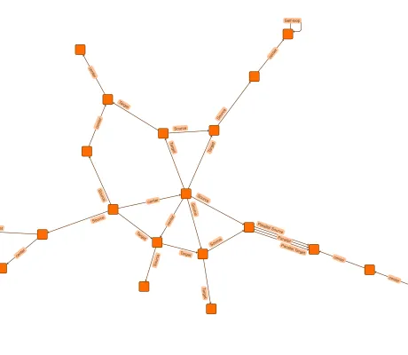

<!--
 //////////////////////////////////////////////////////////////////////////////
 // @license
 // This file is part of yFiles for HTML.
 // Use is subject to license terms.
 //
 // Copyright (c) 2026 by yWorks GmbH, Vor dem Kreuzberg 28,
 // 72070 Tuebingen, Germany. All rights reserved.
 //
 //////////////////////////////////////////////////////////////////////////////
-->
# Organic Layout with Edge Labeling

[You can also run this demo online](https://www.yfiles.com/demos/layout-features/organic-edge-labeling/).

This demo shows how to configure the [OrganicLayout](https://docs.yworks.com/yfileshtml/api/OrganicLayout) for automatic edge label placement.

## Label Placement

[Label models](https://docs.yworks.com/yfileshtml/api/ILabelModel) and their [parameters](https://docs.yworks.com/yfileshtml/api/ILabelModelParameter) control where labels appear. For manuel placements, it's common to use models that limit possible positions. However, for automatic layout, it's best to use unrestricted models like [FreeEdgeLabelModel](https://docs.yworks.com/yfileshtml/api/FreeEdgeLabelModel) for maximum flexibility.

You can further guide label placement using [EdgeLabelPreferredPlacement](https://docs.yworks.com/yfileshtml/api/EdgeLabelPreferredPlacement), which specifies preferences such as placing labels near the edge's source or target, on a particular side, or with a specific rotation. For better results when using organic layout, both the side and angle of the labels relative to the edge path should be specified.

Note that self-loops and parallel edges are handled by [SelfLoopRouter](https://docs.yworks.com/yfileshtml/api/SelfLoopRouter) and [ParallelEdgeRouter](https://docs.yworks.com/yfileshtml/api/ParallelEdgeRouter) respectively. Thus, labels of such edges are not considered by the organic layout algorithm. To place the labels of these edges, a [GenericLabeling](https://docs.yworks.com/yfileshtml/api/GenericLabeling) algorithm has to be applied as a post-processing step.

## Things to Try

- Observe "Source" and "Parallel Source" labels near the edge's source node.
- Observe "Target" and "Parallel Target" labels near the target node.
- Check how labels on parallel edges and self-loops are handled by the generic labeling algorithm.

## Demos

- [Edge Label Placement Demo](../../layout/edgelabelplacement/)

## Documentation

- [Labeling](https://docs.yworks.com/yfileshtml/dguide/organic_layout#_labeling_3)
- [Automatic Label Placement](https://docs.yworks.com/yfileshtml/dguide/label_placement)
- [EdgeLabelPreferredPlacement](https://docs.yworks.com/yfileshtml/api/EdgeLabelPreferredPlacement)
- [GenericLabeling](https://docs.yworks.com/yfileshtml/api/GenericLabeling)
- [FreeEdgeLabelModel](https://docs.yworks.com/yfileshtml/api/FreeEdgeLabelModel)
