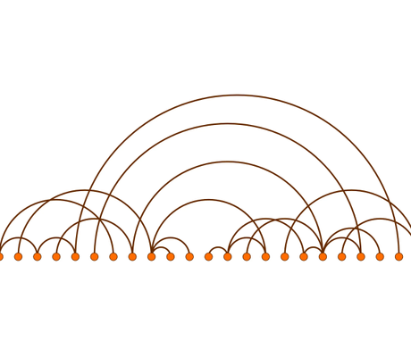

# Arc Diagram Demo

[You can also run this demo online](https://live.yworks.com/demos/layout/arc-diagram/index.html).

# Arc Diagram Demo

This demo shows how to arrange and visualize a graph as an arc diagram.

In an arc diagram, nodes are placed on a single line and edges are drawn as semicircles.

This demo presents a custom layout algorithm implementation for this layout style.

## Things to Try

Layout the diagram with different types of **node orders**.
