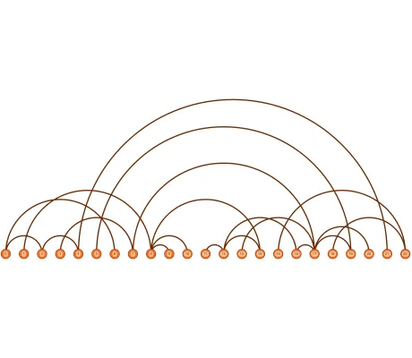

<!--
 //////////////////////////////////////////////////////////////////////////////
 // @license
 // This file is part of yFiles for HTML.
 // Use is subject to license terms.
 //
 // Copyright (c) by yWorks GmbH, Vor dem Kreuzberg 28,
 // 72070 Tuebingen, Germany. All rights reserved.
 //
 //////////////////////////////////////////////////////////////////////////////
-->
# Arc Diagram Demo

[You can also run this demo online](https://www.yfiles.com/demos/layout/arc-diagram/).

This demo shows how to arrange and visualize a graph as an arc diagram.

In an arc diagram, nodes are placed on a single line and edges are drawn as semicircles.

This demo presents a custom layout algorithm implementation for this layout style.

## Things to Try

Layout the diagram with different types of **node orders**.
