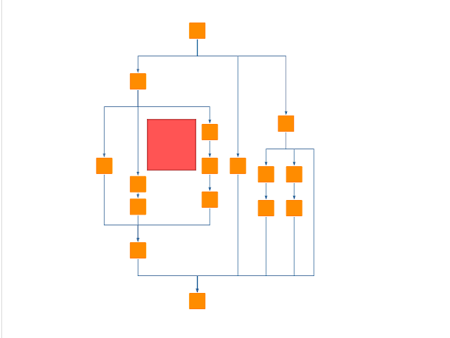

# Clear Marquee Area Demo

[You can also run this demo online](https://live.yworks.com/demos/layout/clearmarqueearea/index.html).

# Clear Marquee Area Demo

A demo that shows how to interactively move graph elements within a marquee rectangle in a given graph layout so that the modifications in the graph are minimal.

Every time the marquee rectangle is dragged interactively, [ClearAreaLayout](https://docs.yworks.com/yfileshtml/#/api/ClearAreaLayout) will push away the other elements so there is a free area for the rectangle.

The **Clear Rectangle Area** demo offers more options for playing around with the [ClearAreaLayout](https://docs.yworks.com/yfileshtml/#/api/ClearAreaLayout).

You can choose between different strategies for clearing the area:

- **Local:** Tries to change the layout rather locally.
- **LocalUniform:** Tries to change the layout rather locally but moving all necessary nodes by a uniform offset.
- **PreserveShapes:** Tries to preserve the shape of the existing edge paths.
- **PreserveShapesUniform:** Globally partitions the graph into two parts and moves them apart.
- **Global:** Divides the graph into two partitions somewhere along the area and moves them horizontally or vertically.

You can choose between different strategies for assigning nodes to components whose elements should preferably not be separated:

- **Single:** Each node is a separate component.
- **Connected:** Components are defined by the connected components.
- **Clustering:** Components are defined by edge betweenness clustering.

## Things to Try

- Drag the mouse with the **right button pressed** to create a marquee rectangle and watch the graph give way to it.
- Start dragging the marquee rectangle within a group node to create more space in the group.
