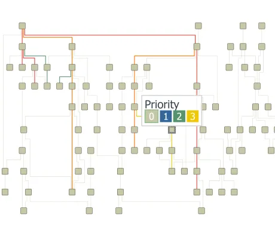

<!--
 //////////////////////////////////////////////////////////////////////////////
 // @license
 // This file is part of yFiles for HTML.
 // Use is subject to license terms.
 //
 // Copyright (c) by yWorks GmbH, Vor dem Kreuzberg 28,
 // 72070 Tuebingen, Germany. All rights reserved.
 //
 //////////////////////////////////////////////////////////////////////////////
-->
# Critical Paths Demo

[You can also run this demo online](https://www.yfiles.com/demos/layout/criticalpaths/).

This demo shows how the hierarchical and tree layout styles emphasise important, or 'critical', paths.

To make these critical paths more striking, the nodes and edges in each path are aligned if possible.

If there is more than one critical path, priorities can be assigned to define which path should be aligned in case a node or edge is part of more than one critical path.

## Things to Try

- Use the toolbar button to mark random paths in the graph and see how the layout changes.
- Add custom priorities by clicking on an edge and choosing a priority from the pop-up.
- Mark an upstream path by clicking a node and choosing a priority from the pop-up.
- Switch between samples for hierarchical and tree layout.
