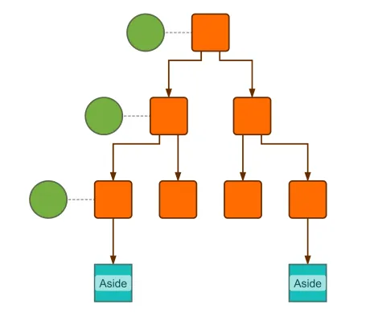

<!--
 //////////////////////////////////////////////////////////////////////////////
 // @license
 // This file is part of yFiles for HTML.
 // Use is subject to license terms.
 //
 // Copyright (c) by yWorks GmbH, Vor dem Kreuzberg 28,
 // 72070 Tuebingen, Germany. All rights reserved.
 //
 //////////////////////////////////////////////////////////////////////////////
-->
# Custom Layout Stage Demo

[You can also run this demo online](https://www.yfiles.com/demos/layout/custom-layout-stage/).

## Custom Layout Stage Demo

[Layout Stages](https://docs.yworks.com/yfileshtml/#/dguide/layout-layout_stages) provide a way of separating a complete layout into different parts. This often involves changing the graph in certain ways before another stage acts on it, post-processing the graph after another stage, or even both. Layout stages are designed to be chained, in that they each have a so-called “core” layout that performs the actual work after pre- or before post-processing.

yFiles for HTML ships with a large variety of layout stages, all sharing the interface [ILayoutStage](https://docs.yworks.com/yfileshtml/#/api/ILayoutStage). If a specific use case is not covered by existing stages, it is easy to write own custom stages by extending class [LayoutStageBase](https://docs.yworks.com/yfileshtml/#/api/LayoutStageBase). When writing custom stages it is necessary to work with the [Layout Graph Model](https://docs.yworks.com/yfileshtml/#/dguide/layout_graph_model).

This demo application shows three simple custom layout stages, which demonstrate different problems and possible solutions with a custom layout stage.

`MoveNodesAsideStage`

Temporarily removes the blue nodes, runs its core layout, and re-inserts the blues nodes as a vertical stack on the right side.

`AlignmentStage`

Inserts temporary edges, along with certain constraints to help the core [HierarchicalLayout](https://docs.yworks.com/yfileshtml/#/api/HierarchicalLayout) align the green nodes. The nodes are selected via a [IDataProvider](https://docs.yworks.com/yfileshtml/#/api/IDataProvider) registered with the graph under a certain key.

`ZigZagEdgesStage`

A pure post-processing stage that changes the edge paths produced by the core layout to a zig-zag shape.

See the sources for details.
