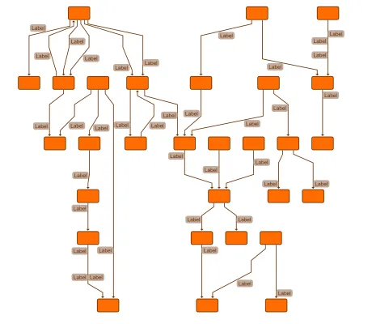

<!--
 //////////////////////////////////////////////////////////////////////////////
 // @license
 // This file is part of yFiles for HTML.
 // Use is subject to license terms.
 //
 // Copyright (c) 2026 by yWorks GmbH, Vor dem Kreuzberg 28,
 // 72070 Tuebingen, Germany. All rights reserved.
 //
 //////////////////////////////////////////////////////////////////////////////
-->
# Edge Label Placement Demo

[You can also run this demo online](https://www.yfiles.com/demos/layout/edgelabelplacement/).

This demo shows how to place edge labels at the preferred location with a labeling algorithm and the [EdgeLabelPreferredPlacement](https://docs.yworks.com/yfileshtml/api/EdgeLabelPreferredPlacement) type.

## Usage

- To add a new label to a selected edge, press Shift + F2.
- Changes of the label properties are immediately applied to the selected labels, or to all labels if no label is selected, and a new layout is calculated to visualize the result of these settings.
- The selected layout is calculated immediately after changing any of the label properties or if the Refresh Layout button is pressed.

## Edge Label Properties

### Distance to Edge

The distance between the edge and the closest label corner.

### Placement Along Edge

Whether the label should be placed near the source or target node, centered between source and target or anywhere. Placement at source port or at target port is only supported by hierarchical layout. In all other cases, it is replaced by at source/at target respectively.

### Side of Edge

Whether the label should be placed centered on the edge or on the left or right side.

### Side Reference

Determines if 'left' and 'right' of the edge are interpreted relative to the edge direction or using the absolute position. In the latter case, the side is ambiguous for horizontal segments, and either the left or the right side can be 'North' of the edge.

### Angle (In Degrees)

The rotation angle (in degrees) of the label.

### Angle Reference

Whether the rotation angle is relative to the edge slope or absolute.

### Angle Rotation on Right Side

While the angle for labels on the edge and left of the edge is always interpreted clockwise, the rotation for labels on the right side can either be interpreted clockwise or counter-clockwise.

### Add 180° on Right Side

Whether labels on the right side should be rotated by additional 180 degrees.
