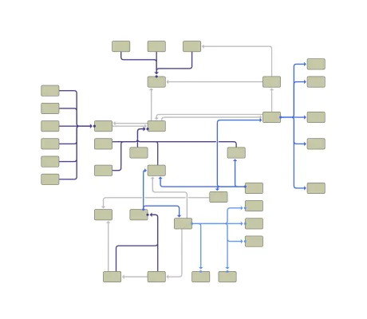
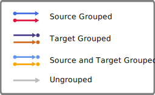

<!--
 //////////////////////////////////////////////////////////////////////////////
 // @license
 // This file is part of yFiles for HTML.
 // Use is subject to license terms.
 //
 // Copyright (c) by yWorks GmbH, Vor dem Kreuzberg 28,
 // 72070 Tuebingen, Germany. All rights reserved.
 //
 //////////////////////////////////////////////////////////////////////////////
-->
# EdgeRouter Grouping Demo

[You can also run this demo online](https://www.yfiles.com/demos/layout/edgeroutergrouping/).

This demo shows the possibilities of edge and port grouping using the [EdgeRouter](https://docs.yworks.com/yfileshtml/#/api/EdgeRouter). Edge groups lead to edges sharing some segments while port groups will combine the edges only in their first segment.

## Things to Try

- Use the combo-box in the toolbar to toggle between edge grouping and port grouping.
- Customize the grouping information in the graph using the context menu. You can either:
  - Right-Click on the canvas and group/ungroup all edges at the same time
  - Right-Click on an edge or selection of edges and group/ungroup the incident edges
  - Right-Click on a node or selection of nodes and group/ungroup the incident edges
- Reset the graph and start again with the initial sample.

## Grouping Types

