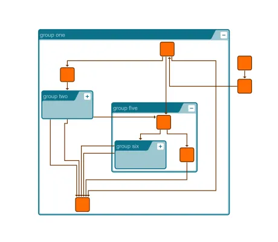

<!--
 //////////////////////////////////////////////////////////////////////////////
 // @license
 // This file is part of yFiles for HTML.
 // Use is subject to license terms.
 //
 // Copyright (c) 2026 by yWorks GmbH, Vor dem Kreuzberg 28,
 // 72070 Tuebingen, Germany. All rights reserved.
 //
 //////////////////////////////////////////////////////////////////////////////
-->
# Folding With Layout Demo

[You can also run this demo online](https://www.yfiles.com/demos/layout/foldingwithlayout/).

This demo shows how to automatically trigger a layout that clears or fills the space when opening or closing groups.

Every time a group node is expanded interactively, [ClearAreaLayout](https://docs.yworks.com/yfileshtml/api/ClearAreaLayout) will push away the other nodes so there is a free area for the expanded node and its (currently visible) children.

## Things to Try

Open and close the various group nodes.
