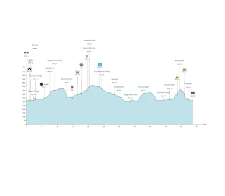

<!--
 //////////////////////////////////////////////////////////////////////////////
 // @license
 // This file is part of yFiles for HTML.
 // Use is subject to license terms.
 //
 // Copyright (c) by yWorks GmbH, Vor dem Kreuzberg 28,
 // 72070 Tuebingen, Germany. All rights reserved.
 //
 //////////////////////////////////////////////////////////////////////////////
-->
# Height Profile Demo

[You can also run this demo online](https://www.yfiles.com/demos/layout/height-profile/).

This demo shows how to configure the [OrganicLayout](https://docs.yworks.com/yfileshtml/#/api/OrganicLayout) algorithm to create a height profile visualization.

The dataset consists of points that form a trekking trail (i.e., the blue curve) and some points of interest, namely the waypoints (i.e., the orange-colored nodes). For each of these waypoints a label node is created that displays the information associated with the waypoint.

This demo defines alignment constraints for the [OrganicLayout](https://docs.yworks.com/yfileshtml/#/api/OrganicLayout) algorithm. These constraints ensure that waypoints and their associated label nodes are vertically aligned with the waypoints being placed below their labels.

The axis and the trail visualizations have been created using custom [IVisualCreator](https://docs.yworks.com/yfileshtml/#/api/IVisualCreator) implementations.

In a similar manner, the [OrganicLayout](https://docs.yworks.com/yfileshtml/#/api/OrganicLayout) can be configured to display a timeline visualization in which a number of events have to be ordered by time.

## Things to try

- Some of the waypoint data items reference a picture of the corresponding location. Hover over a node to show the picture.
