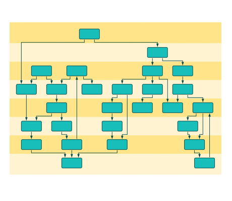

# Incremental Hierarchic Layout Demo

[You can also run this demo online](https://live.yworks.com/demos/layout/incrementalhierarchic/index.html).

# Incremental Hierarchic Layout Demo

This demo shows the _incremental mode_ of the hierarchic layout. Each user action triggers a run of this layout style to ensure that the current state of the graph is always well-organized but remains still similar to the previous arrangement.

The layers of the layout are visualized in the background of the graph.

## Things to Try

- Move and resize nodes and watch the layout update. During moves the target layer is indicated.
- Create edges and see the routes being recalculated immediately.
- Create new nodes and observe how they are inserted into the drawing near the place they have been created.
- Drag the first and last bend (or create one) of an edge to interactively assign or reset port constraints.
- Use the context menu to reroute selected edges or optimize selected node locations.
