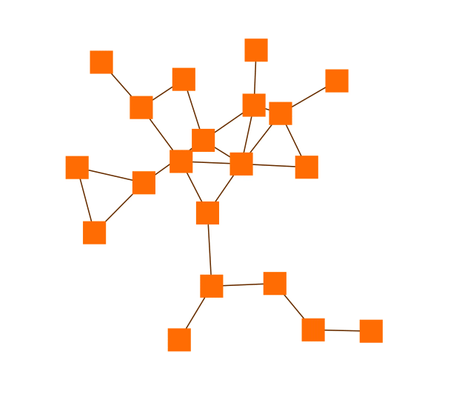

# Interactive Organic Layout Demo

[You can also run this demo online](https://live.yworks.com/demos/layout/interactiveorganic/index.html).

# Interactive Organic Layout Demo

This demo shows the Interactive Organic layout algorithm. This variant of the general Organic layout algorithm calculates continuous updates for a changing diagram. The Organic layout is a force-directed layout style for multiple purposes.

The node style and the edge style in this demo use canvas rendering for performance reasons.

## Things to Try

- Select nodes by clicking them or with the marquee selection.
- Drag one or more selected nodes.
- The organic layout algorithm is automatically applied while dragging and continuously updates the layout.
- Create nodes by clicking on the canvas.
- Connect nodes by dragging from one (unselected) node to another.
- Delete selected nodes using the delete key.
