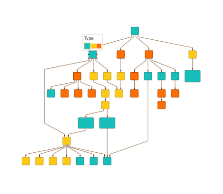

# Node Types Demo

[You can also run this demo online](https://live.yworks.com/demos/layout/nodetypes/index.html).

# Node Types Demo

This demo shows how different layout algorithms handle nodes that are associated with some specific types, see the Developer's Guide section on [Layout with Custom Node Types](https://docs.yworks.com/yfileshtml/#/dguide/node_types). In this example application, nodes with same color are considered to be of the same type.

The type is generally treated as a secondary, subordinate optimization criterion. Thus, nodes of the same type are usually not simply clustered together. The type is only considered when some free choice is available after considering other constraints relevant to the specific layout algorithm (like minimizing the number of crossings or considering the hierarchical grouping structure).

## Things to Try

- Use the combo box to choose a specific layout algorithm. This automatically loads a suitable example graph.
- Compare the results with and without considering node types. Use the 'Consider Types' toggle button to change the setting.
- Modify the graph by adding new elements or changing the type of existing nodes via the context menu and observe the effect on the layout. The context menu can be accessed by clicking on a node.
