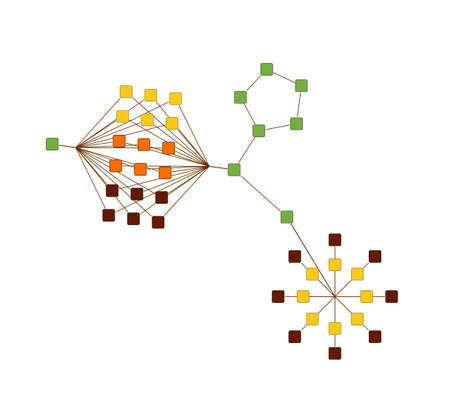

# Organic Substructures Demo

[You can also run this demo online](https://live.yworks.com/demos/layout/organicsubstructures/index.html).

# Organic Substructures Demo

This demo showcases how the [OrganicLayout](https://docs.yworks.com/yfileshtml/#/api/OrganicLayout) algorithm handles substructures and node types, see [Layout of Regular Substructures](https://docs.yworks.com/yfileshtml/#/dguide/organic_layout-substructures) for more information.

The organic layout algorithm is able to identify regular substructures in a graph, like, e.g., chains, stars, cycles, and parallel structures and arrange them in an optimized manner depending on the kind of substructure and user preference. This makes them easily recognizable in the resulting layout. Furthermore, specified node types may influence both substructure detection and placement of elements within the structure.

## Things to Try

- Load an example graph with the combobox 'Sample'.
- In the 'Layout Settings' panel on the right, use the combobox of the specific substructures to try out the different styles supported by each of them. Selecting value 'Ignore' means that the respective structure is ignored and not handle differently.
- Use the checkbox 'Use Edge Grouping' to see how edge grouping changes the flavor of parallel and separated radial star substructures.
- Use the checkbox 'Consider Node Types' to see how considering node types changes substructure detection and layout.
- The simple example graphs also offer to change the node types (i.e. color) by clicking on the nodes. In addition, the structure of these graphs can be modified (use the "Layout" button to calculate a new layout after modifying the graph structure).
