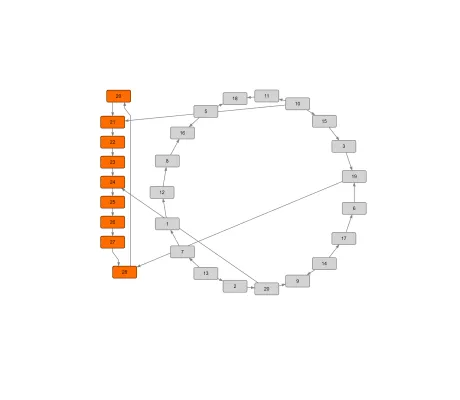

<!--
 //////////////////////////////////////////////////////////////////////////////
 // @license
 // This file is part of yFiles for HTML.
 // Use is subject to license terms.
 //
 // Copyright (c) by yWorks GmbH, Vor dem Kreuzberg 28,
 // 72070 Tuebingen, Germany. All rights reserved.
 //
 //////////////////////////////////////////////////////////////////////////////
-->
# Partial Layout Demo

[You can also run this demo online](https://www.yworks.com/demos/layout/partial/).

Shows how to integrate (new) graph elements into an existing graph layout with [PartialLayout](https://docs.yworks.com/yfileshtml/#/api/PartialLayout).

This layout algorithm changes the coordinates of a given set of graph elements (called _partial_ elements) and leaves the location and size of all other elements (called _fixed_ elements) unchanged. The algorithm aims to place the partial elements such that the resulting drawing (including the fixed elements) has a good quality with respect to common graph drawing aesthetics.

_Partial_ node elements can be assigned to the so called _subgraph components_. During the layout process each _subgraph_ induced by the nodes of a component is first laid out using the specified subgraph layout. Then, the different components are placed one-by-one onto the drawing area such that the number of overlaps among graph elements is small. The user can specify different placement strategies for finding 'good' positions for subgraph components.

The demo allows for specifying fixed and partial elements. _Fixed_ elements are drawn _grey_ and _partial_ elements are _colored_. To change the fixed/partial state of elements, select the corresponding elements and click on the _Lock Selected Elements_ or _Unlock Selected Elements_ button. The current state of the selected elements can be toggled with a mouse-double-click. To start the partial layout click on the play button.

Different scenarios for hierarchical, orthogonal, organic or circular layout are available. A scenario includes a graph arranged with the corresponding layout style and some new graph elements that shall be placed by _PartialLayout_. In addition suitable configuration options are preset.
