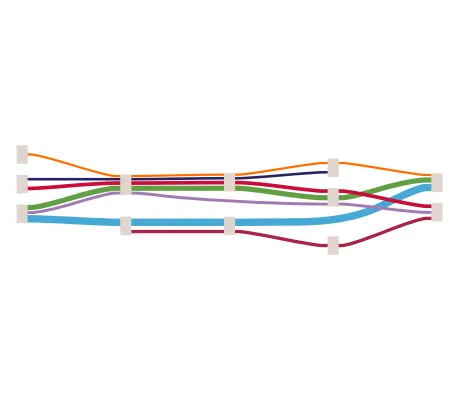

<!--
 //////////////////////////////////////////////////////////////////////////////
 // @license
 // This file is part of yFiles for HTML.
 // Use is subject to license terms.
 //
 // Copyright (c) by yWorks GmbH, Vor dem Kreuzberg 28,
 // 72070 Tuebingen, Germany. All rights reserved.
 //
 //////////////////////////////////////////////////////////////////////////////
-->
# Port Alignment Demo

[You can also run this demo online](https://www.yfiles.com/demos/layout/port-alignment/).

This demo shows how to implement port alignment in [HierarchicalLayout](https://docs.yworks.com/yfileshtml/#/api/HierarchicalLayout).

The sample data contains edges that belong to different path groups, indicated by the different edge color. The demo code aligns all source and target ports with the edge paths by configuring the [sourcePortAlignmentIds](https://docs.yworks.com/yfileshtml/#/api/PortData#sourcePortAlignmentIds) and [targetPortAlignmentIds](https://docs.yworks.com/yfileshtml/#/api/PortData#targetPortAlignmentIds) properties of the [PortData](https://docs.yworks.com/yfileshtml/#/api/HierarchicalLayoutData#ports).

As a result, the aligned source and target ports at every node have the same y-coordinate, creating the visual effect in which the edges seem to pass through the node.

Port alignment is particularly useful in graphs where there are paths passing through. It is less restrictive in comparison to port grouping, since the ports of the aligned edges can lie on two opposite sides of a node.

## Things to Try

- Toggle between layouts with and without port alignment with the _Align Ports_ button in the toolbar.
- Adjust _Minimum Port Distance_ with the slider in the toolbar and observe how nodes automatically resize to meet the minimum.
