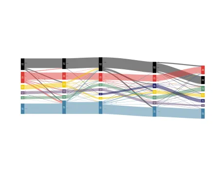

<!--
 //////////////////////////////////////////////////////////////////////////////
 // @license
 // This file is part of yFiles for HTML.
 // Use is subject to license terms.
 //
 // Copyright (c) 2026 by yWorks GmbH, Vor dem Kreuzberg 28,
 // 72070 Tuebingen, Germany. All rights reserved.
 //
 //////////////////////////////////////////////////////////////////////////////
-->
# Sankey Demo

[You can also run this demo online](https://www.yfiles.com/demos/layout/sankey/).

Sankey diagrams are used for visualizing flow information in which the thickness of the edges is proportional to the flow quantity. Such diagrams can be produced by means of the hierarchical layout algorithm (see [HierarchicalLayout](https://docs.yworks.com/yfileshtml/api/HierarchicalLayout)).

The example diagram shows a voters' migration flow between different political parties over the course of four elections (each column represents an election). The flow is depicted from left to right.

The political parties in each layer (excluding the non-voter) are sorted by their voters in each election. The non-voter is always placed at the bottom each layer.

## Things to Try

- Change the number displayed in each edge label to modify the thickness of a particular edge.
- Move a node along its layer to run a new layout that will consider the new layer ordering.
- Click on a node to modify its color through a popup menu.
- Use the dropdown to switch how the colors of edges are determined. Selecting the 'outgoing' setting, it is easier to see where edges come from while selecting the 'incoming' setting, it is easier to see where edges go to.
- Hover over an edge to highlight the edge and its associated labels.
- Hover over an edge label to highlight the label and its associated edge.
